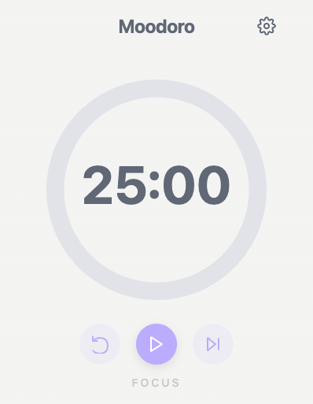

<div align="center">

# 🍅 Moodoro

### A Modern Pomodoro Timer for Your Desktop

Moodoro is a minimalist desktop Pomodoro Timer built to help you stay focused, block distractions, and boost productivity using the proven Pomodoro Technique.

Built with Electron.js and powered by the [Electron React Boilerplate](https://github.com/electron-react-boilerplate/electron-react-boilerplate), it provides a clean, distraction-free interface right on your desktop — no internet required!



</div>

## ✨ Features

- 🎯 **Focus-First Design**: Clean, distraction-free interface
- ⚡ **Instant Access**: Native desktop app, no browser needed
- 🔔 **Smart Notifications**: Native system notifications for session transitions
- 🎨 **Theme Support**: Multiple themes to match your mood
- 💻 **Cross-Platform**: Works on macOS, Windows, and Linux
- 🔒 **Privacy-Focused**: Fully offline, no data collection

## 🚀 Getting Started

### Installation (Work In Progress)

1. Download the latest release for your platform from our [Releases](https://github.com/riansap/moodoro/releases) page
2. Run the installer
3. Launch Moodoro and start focusing!

### Development

Prerequisites:

- Node.js (LTS version recommended)
- npm or yarn

```bash
# Clone the repository
git clone https://github.com/riansap/moodoro.git
cd moodoro

# Install dependencies
npm install

# Start development server
npm start

# Build for production
npm run build

# Package the app
npm run package
```

## 🛠 Tech Stack

- Framework : Electron
- Frontend : React + TypeScript
- Boilerplate : Electron React Boilerplate
- Build Tool : Electron Builder

## 🗺 Roadmap

- Customizable sounds/notifications
- Multi-language support
- Session statistics and insights
- Task integration (Notion, Todoist, etc.)

## 👨‍💻 Author

Rian Saputra - @riansap
